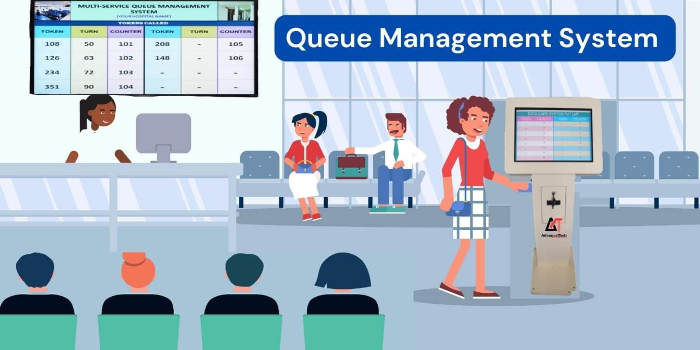
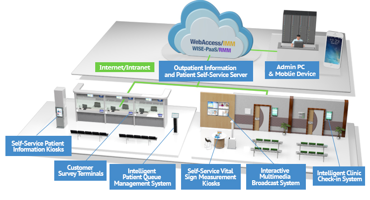
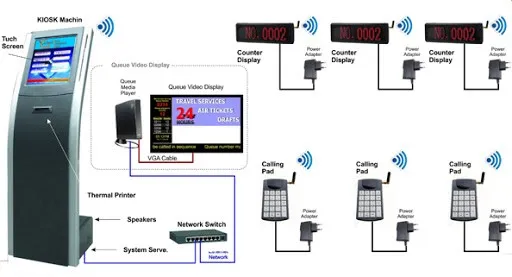
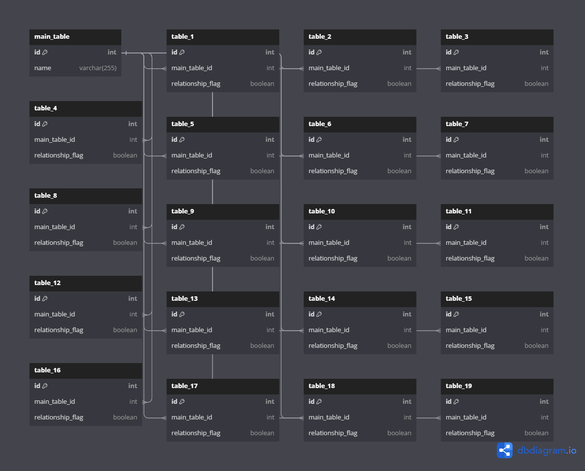

# Queue_System/For haya karima hospitals

  
 </a>

## 📝 Table of Contents

- [About](#about)
- [Technology](#tech)
- [Screenshots](#Screenshots)
  

-[relationship in the database](#database)

## 📙 About 
<h1>Windows form APP c# project</h1>

***A picture showing what the system looks like in reality

 </a>

It is a queue system and this system is used to organize the entry of customers to facilitate services within hospitals and facilitate patients

Where the system works as follows:

1- The patient chooses his doctor through the program through the basic machine of the system inside the hospital, which is the interface of windows form c#

2- The machine prints a sheet with information about the patient's number waiting for the doctor

3- The doctor requests from his control panel the next patient

4- The voice speaker requests the patient and the patient enters his doctor accordingly

## 💻 Built Using 
- **SQL**
- **.net**
- **C#**
- **Windows form APP**
- **microsoft sql server**
## 📷 Screenshots 

  <h2>### First, explain how to configure the program </h2>

Note: This is the program found on the patient’s service request device

  <h2>1-Log in to edit 
The person in charge of the hospital adjusts the program according to the number of doctors present and also changes the color and identifies the names of the doctors 
The program has the capacity to accommodate a maximum of 200 doctors</h2>
   </a> 
   </a>
 
 
To modify the color of the button for each doctor, as well as his name, and also hide the button for this doctor

   </a>
   

   
When you hide the doctor's button, the patient cannot request this doctor 
The doctor can press the wait button on his control panel for it to appear in this form to the patient

   </a>
   

   

   <h2>###How the entire system works and how does the program communicate with the doctors’ control panel</h2>
   
**An external view of the project

   </a>
    </a>
   
How much do we see above? 
The main device (the device that the patient orders from)
When the patient makes the request, it appears with the doctor on his control panel, which is called in the picture (pad).
The doctor presses a button called (next), and the headphone speaks the patient’s number, so the patient goes to the specified room.

   

   

   <h2 name="database">###The relationship in the database</h2>
   </a>
    
   </a>

**As we can see above, I have 200 tables in the project database 
All of them have a relationship with the main table 
Each table represents a doctor in the GUI, and each doctor represents a button 
The patient orders through it

   

   

  
   

